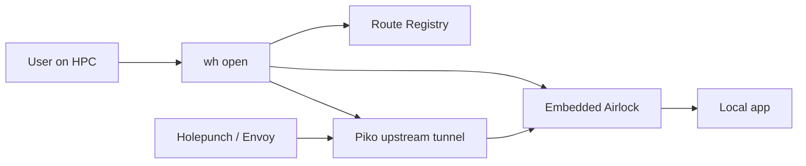

# `wormhole-cli`

### Command Line Interface for LC Wormhole

`wormhole-cli`, installed for users as `wh`, opens Wormholes from HPC or local
applications to the Wormhole platform.

## Table of Contents

- [Description](#description)
- [How the CLI Fits Into Wormhole](#how-the-cli-fits-into-wormhole)
- [Installation and Deployment](#installation-and-deployment)
- [Configuration](#configuration)
- [Running](#running)
- [Namespacing](#namespacing)
- [Testing](#testing)
- [Developer Notes](#developer-notes)
- [Governance](#governance)

## Description

`wh` is a Go CLI that creates and forwards connections from user applications
into Wormhole. The main `wh open` command registers a route with Route
Registry, starts an embedded Airlock proxy for local request authentication,
and opens a Piko upstream tunnel that forwards approved Wormhole traffic to the
application port. Major dependencies include Go, the sibling `airlock` module,
the Piko client, `urfave/cli/v3`, `cli-altsrc`, Zap, and `x/sync/errgroup`.

The code is organized around `main.go`, which wires signal handling, logging,
version printing, and CLI task registration. User-facing commands live in
`internal/cmd/wh`; HTTP request helpers live in `internal/requester`; Route
Registry API types and client behavior live in `internal/routeregistry`; Linux
namespace support lives in `internal/ns`; and version metadata lives in
`internal/version`. Output is intentionally plain text and table oriented so it
is usable from HPC login shells and scripts.

Within Wormhole, the CLI is the user entry point for launching apps. It hides
the lower-level work of creating Route Registry records, preparing Airlock
authorization metadata, opening the outbound Piko tunnel, and optionally
isolating the launched workload in Linux namespaces. Users get a stable
Wormhole URL without manually configuring SSH tunnels, VNC, Piko, Airlock, or
gateway rules.

## How the CLI Fits Into Wormhole



The tunnel connection is outbound from the compute node. When namespaced mode is
used, the app and Piko agent run in isolated Linux namespaces so other users on
the node cannot directly connect to the app.

## Installation and Deployment

### User Installation

On HPC systems, `wormhole-cli` is expected to be distributed as a user-facing
`wh` binary on the target clusters. Site deployment should place the binary on
the user `PATH` and provide a default config file at:

```text
/etc/wormhole/cli/wh.toml
```

### Build from Source

For local development:

```shell
go build -o wh .
```

The project Makefile writes build artifacts to `binaries/`:

```shell
make build
```

This creates `binaries/wormhole-cli`. Site packaging may rename or symlink this
binary to `wh`.

Build Linux release artifacts:

```shell
make build-linux
```

This creates Linux amd64 and arm64 binaries in `binaries/`.

Spack and direnv support are available through `spack.yaml` and `.envrc`.

## Configuration

Global options:

```text
--config string  Path to a wh.toml configuration file (default: /etc/wormhole/cli/wh.toml)
--endpoint       Optional custom Route Registry endpoint
--token          Required Wormhole authentication token
--verbose        Enable verbose logging
```

Environment variables map to CLI flags:

```text
WORMHOLE_CONFIG
WORMHOLE_ENDPOINT
WORMHOLE_TOKEN
WORMHOLE_VERBOSE
WORMHOLE_NAME
WORMHOLE_COMMUNITY
WORMHOLE_APP_PORT
WORMHOLE_ALLOWED_GROUPS
WORMHOLE_ALLOWED_USERS
WORMHOLE_FORBIDDEN_USERS
WORMHOLE_FORBIDDEN_GROUPS
WORMHOLE_FORWARDED_HEADER_USER
WORMHOLE_FORWARDED_HEADER_GROUPS
```

The `--config` flag points to a TOML file. Environment variables are the most
direct and consistently used configuration path in the current implementation.

## Running

### Open a Wormhole

Usage:

```text
wh open [options] [--] [command [options ...]]
```

Open a Wormhole to an already-running app on port 8080:

```shell
wh --token "$WORMHOLE_TOKEN" open \
  --name galactic-vis-app \
  --app-port 8080 \
  --allowed-groups project-a
```

Launch an app in namespaced mode and open a Wormhole to it:

```shell
wh --token "$WORMHOLE_TOKEN" open \
  --name galactic-vis-app \
  --app-port 8080 \
  --allowed-users alice,bob \
  -- python -m http.server 8080
```

`wh open` options:

| Option | Purpose |
| --- | --- |
| `--name` | Wormhole name used for the URL, such as `galactic-vis-app`. Required. Names may not contain underscores. |
| `--community` | Optional app community group for shared authentication. |
| `--app-port` | Local application port to forward. Defaults to `8080`. |
| `--allowed-groups` | Comma-separated groups allowed to access the app. |
| `--allowed-users` | Comma-separated users allowed to access the app. |
| `--forbidden-users` | Comma-separated users explicitly denied access. |
| `--forbidden-groups` | Comma-separated groups explicitly denied access. |
| `--forwarded-header-user` | Header populated with request username. Defaults to `X-Forwarded-User`. |
| `--forwarded-header-groups` | Header populated with request groups. Defaults to `X-Forwarded-Groups`. |

At least one allowed user or allowed group is required. A user or group cannot
be both allowed and forbidden for the same route.

### Manage Routes

List routes:

```shell
wh --token "$WORMHOLE_TOKEN" route list
```

Show one route by fully qualified name or ID:

```shell
wh --token "$WORMHOLE_TOKEN" route list route_id
```

### Manage Communities

List communities:

```shell
wh --token "$WORMHOLE_TOKEN" community list
```

Show one community:

```shell
wh --token "$WORMHOLE_TOKEN" community list my-community
```

Create and remove a community:

```shell
wh --token "$WORMHOLE_TOKEN" community add my-community
wh --token "$WORMHOLE_TOKEN" community remove my-community
```

Associate routes with a community:

```shell
wh --token "$WORMHOLE_TOKEN" community add-route my-community route_id
wh --token "$WORMHOLE_TOKEN" community remove-route my-community route_id
```

Route and community identifiers can be names or sufficiently long partial IDs
where supported by Route Registry.

## Namespacing

If an additional command is specified after the options for `open`, Wormhole
runs that command in an isolated network namespace and forwards traffic through
Airlock and Piko. This prevents incoming connections from external sources and
helps isolate the app from other users on the node.

Namespaced mode is Linux-only. Non-Linux builds return `Not implemented` for
namespace setup. Linux systems must have user namespaces enabled through
`/proc/sys/user/max_user_namespaces`, and namespaced networking uses
`slirp4netns`.

Wormhole creates the following namespace types when running a command in
namespaced mode:

- PID
- mount
- net
- user
- IPC

The following directories are mounted:

- `/proc`
- `/dev/pts`
- `/run/user` as `tmpfs`

Podman compatibility mode adds extra bind mounts used by container workflows.

## Testing

Run the Go test suite with coverage:

```shell
make test
```

Additional checks:

```shell
make test-quality
make test-vuln
make coverage
make mocks
```

`make test-quality` requires `golangci-lint`; `make test-vuln` requires
`govulncheck`; `make mocks` requires `mockgen`.

## Developer Notes

- `internal/cmd/wh/wh.go` implements `open`, route registration, embedded
  Airlock startup, and Piko upstream startup.
- `internal/routeregistry` contains the Route Registry client used by
  `route` and `community` commands.
- `internal/requester` wraps authenticated HTTP calls using the `X-Token`
  header and JSON content type.
- `internal/ns` owns Linux namespace setup and lifecycle behavior.
- The `open` command currently performs route registration through a direct
  route API call, while route/community management uses the shared
  `RegistryService` abstraction.

## Governance

Contributions are welcome. Contributors should look in `CONTRIBUTING.md` for
project guidelines on how to create and structure pull requests.

This project is licensed under the Apache 2.0 license with LLVM exception. The
full license text is available in `LICENSE`.

LLNL-CODE-2020712
